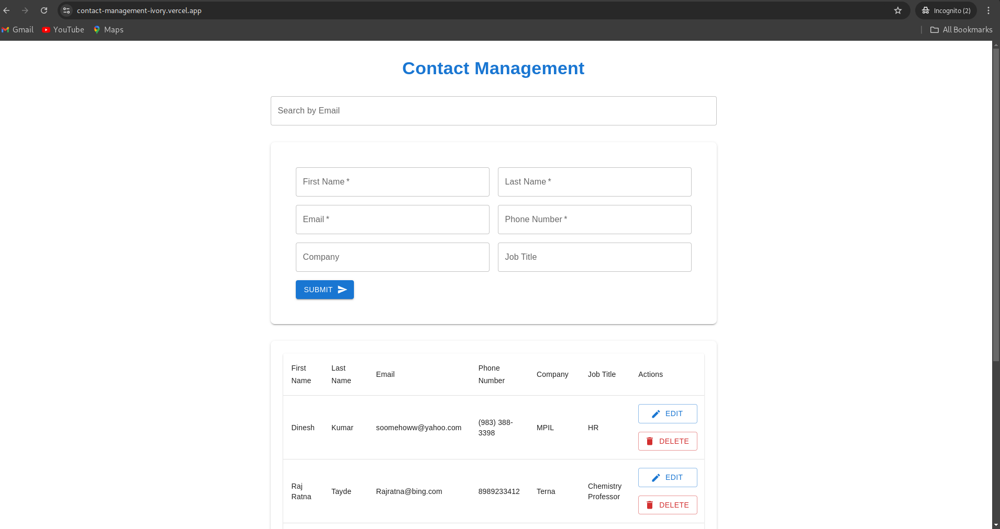

# Contact Management System

A full-stack contact management application that allows users to add, edit, delete, and manage their contacts seamlessly. The application supports pagination, searching by email, and a user-friendly interface built with React and Material-UI.

---



## Project Overview

This project demonstrates a robust implementation of a contact management system. The frontend is built using **React** and **Material-UI** for a responsive and clean UI, while the backend uses **Node.js** and **Express** for a scalable API, with **MongoDB Atlas** as the database.

### Key Features:
- Add, edit, and delete contacts.
- Search functionality using email addresses.
- Paginated contact listing using Material-UI.
- Real-time updates in the UI for CRUD operations.
- Deployed on **Vercel** (frontend) and **Render** (backend).

### Why MongoDB Atlas?
- **Scalability:** MongoDB Atlas allows easy scaling as the application grows.
- **Cloud-Based:** Eliminates the need to manage local database servers, ensuring high availability.
- **Flexibility:** MongoDB’s document-based structure is ideal for handling unstructured and semi-structured data like user contacts.

---

## Project Structure

### Frontend (`/client`)
- **React Components:** Modular components like `ContactForm`, `ContactsTable`, and modals for editing/deleting contacts.
- **Material-UI:** Used for designing the UI components with modern and responsive layouts.
- **API Integration:** Axios is used for API calls to the backend.

### Backend (`/server`)
- **Node.js & Express:** REST API with endpoints for managing contacts.
- **MongoDB Atlas:** Stores contact details securely in the cloud.
- **Routes, Controllers, Models:** Organized code structure for scalability and maintenance.

---

## Setup Instructions

### Prerequisites:
- Node.js (v14 or higher)
- MongoDB Atlas account
- npm or yarn installed

### Steps to Run Locally:

#### 1. Clone the Repository:
```bash
git clone https://github.com/your-repo/contact-management.git
cd contact-management
```

### 2. Setup Backend:
1. **Navigate to the backend folder:**
    ```bash
    cd server
    ```

2. **Install dependencies:**
    ```bash
    npm install
    ```

3. **Create a `.env` file:**
    ```env
    MONGO_URI=your-mongodb-atlas-connection-string
    PORT=5000
    FRONTEND_URL=http://localhost:3000
    ```

4. **Start the server:**
    ```bash
    node server.js
    ```

## 3. Setup Frontend:
1. **Navigate to the frontend folder:**
    ```bash
    cd ../client
    ```

2. **Install dependencies:**
    ```bash
    npm install
    ```

3. **Create a `.env` file:**
    ```env
    REACT_APP_API_BASE_URL=http://localhost:5000
    ```

4. **Start the development server:**
    ```bash
    npm start
    ```

## 4. Access the Application:
- **Frontend:** [http://localhost:3000](http://localhost:3000)
- **Backend:** [http://localhost:5000](http://localhost:5000)

## Database Schema
**MongoDB Collection:** contacts

```json
{
  "_id": "ObjectId",
  "firstName": "String",
  "lastName": "String",
  "email": "String",
  "phoneNumber": "String",
  "company": "String",
  "jobTitle": "String"
}
```

## Deployment Links

**Frontend (Vercel):** https://contact-management-ivory.vercel.app/

**Backend (Render):** https://contact-backend-imcz.onrender.com

## Challenges and Solutions

**Pagination with Material-UI**

**Issue:** Had never used Material-UI before, primarily worked with TailwindCSS and Bootstrap. Understanding its theming and component structure was time-consuming.

**Solution:** Referenced the official Material-UI documentation and examples to implement pagination. Gradually familiarized myself with its styling system.


## Technical Decisions 
**MongoDB Atlas:**
Provides scalability and ease of setup for cloud-based storage.

**Axios:**
Simplifies API integration with built-in error handling and cleaner syntax.

**Deployment:**
Frontend deployed on Vercel for continuous deployment and fast delivery.
Backend deployed on Render for seamless hosting with environment variable support.


## How It Works 
**Frontend:**
Users interact with the UI to add, edit, or delete contacts.
Pagination and search features allow efficient navigation and filtering.

**Backend:**
REST API endpoints handle data operations, interacting with MongoDB for persistence.

**Database:**
Stores contact details, ensuring quick and reliable access.

Feel free to contribute to this project or provide feedback! 😊

